# AudioSub 流程图说明

> 本文按「每条链路一章 + 一张流程图 + 要点补充」的方式讲清整个系统。
> **如何在本机跑起来**见 [usage-guide.md](usage-guide.md)。
> 链路编号见 [current-implementation-flow.md](current-implementation-flow.md)；
> 逐环节代码细节见 [pipeline-deep-dive.md](pipeline-deep-dive.md)。
>
> 先记住三条总约定：
> - 讲话方恒为 **A**（WebRTC 发起方 offerer），**B** 是接收 + 识别（ASR）方。
> - 信令走 **TCP + 一行一条 JSON**，只用于交换 SDP/ICE，连通后音频不再经过它。
> - 音频有两条链路：**默认 WebRTC ADM 音轨（走 RTP）**，对照 **WASAPI 直采（走 DataChannel）**；
>   CLI 默认 `webrtc`，用 `--audio-path wasapi` 切换。

---

## 全局总览

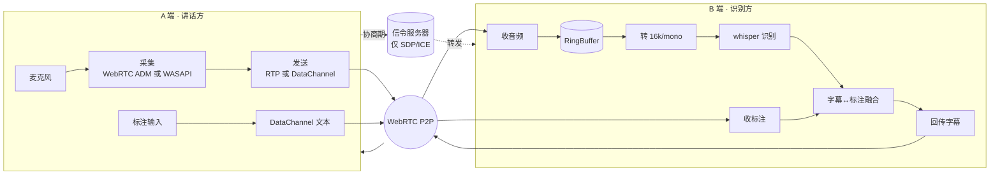

---

## 一、A 和 B 是怎么建立 P2P 连接的（信令 + 媒体）

### 为什么需要信令服务器

- WebRTC 是点对点的，但两端一开始互不知道对方的存在、地址、支持的编解码，必须有个双方都能先连上的「中间人」帮它们对暗号。
- WebRTC 故意不规定中间人怎么实现，用 HTTP、WebSocket 都行；本项目用最简单的 **TCP 长连接 + 每行一条 JSON**。
- 中间人只在「建立连接」阶段传几条小消息，**P2P 一旦通了，音频/数据完全不经过它**。

**需要交换的信息**

- **SDP（会话描述）**：一大段文本，描述「我支持哪些编解码、用什么传输参数」。发起方发的叫 **Offer**，应答方回的叫 **Answer**，一来一回双方就对齐了媒体能力。
- **ICE candidate（网络地址候选）**：每端列出「我可能能被连上的地址」（内网 IP、经路由器看到的公网 IP、中转地址等），一条条发给对方；两边两两配对去试，试通一条 P2P 通道就建起来了。本项目配了 Google 的 STUN 帮忙发现公网 IP（同机/同局域网用不到）。

### 信令传输层

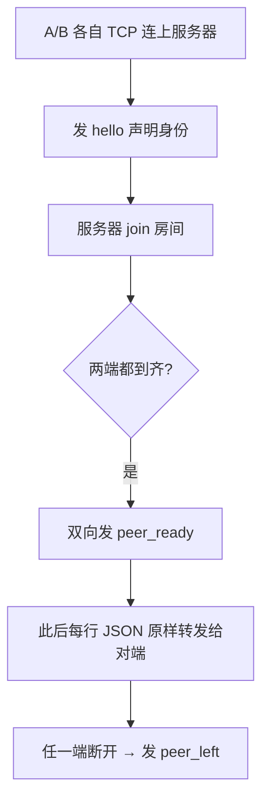

- 服务器（`signaling/server.py`）**不解析**业务字段，offer/answer/candidate 都走同一段透明转发。
- 客户端（`client/signaling_client.cc`）主线程发、后台线程收；TCP 是字节流，需自己按 `\n` 拆行处理粘包/拆包；`Send()` 加锁防多线程写交错。

### 协商时序（一份 Offer 同时谈妥音频管 + 数据管）

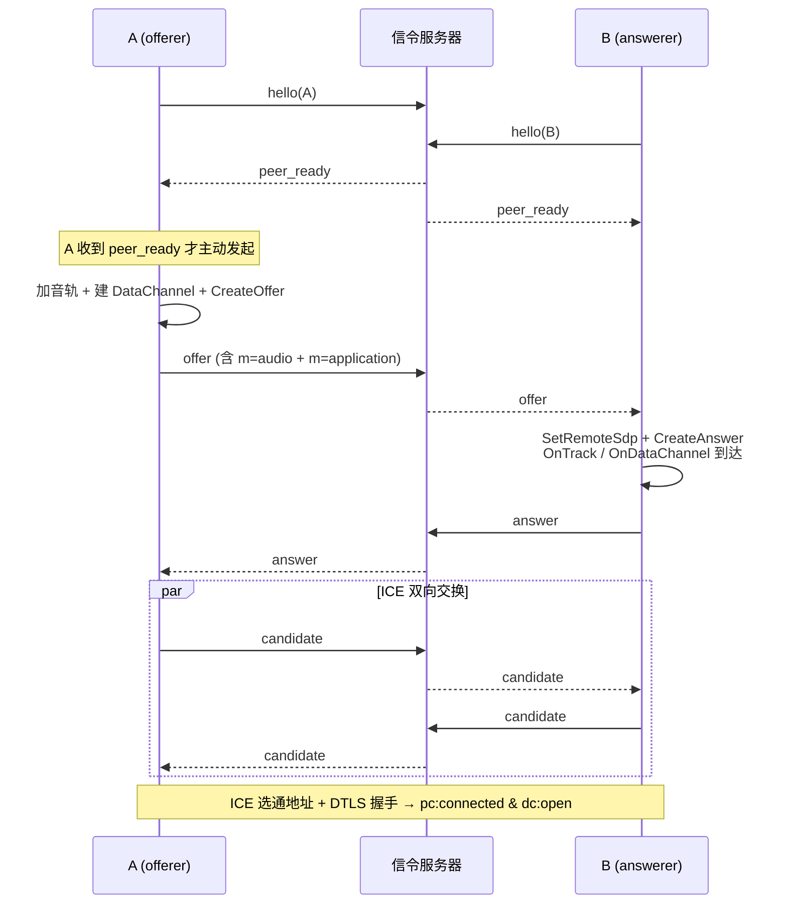

- **A 当 offerer 是约定**：只有 `id=="A"` 在收到 `peer_ready` 时发起，避免双方同时发 Offer（glare）。
- **DataChannel 必须在 CreateOffer 之前建**，否则 Offer 里没有数据通道的 `m=` section，B 不会触发 `OnDataChannel`。
- SDP 是**异步**生成：`CreateOffer` → `OnLocalSdpReady` → 先 `SetLocalDescription`，再把 SDP 经信令发给对端。
- **加密**：媒体用 SRTP、数据用 DTLS，密钥在 DTLS 握手时协商；`Initialize()` 里必须先 `InitializeSSL()`。
- **判断通了**：看到 `pc:connected`（`OnConnectionChange`）和 `dc:open`（DataChannel `OnStateChange`）即成功。

> 关键代码：`peer_connection_client.cc` 的 `CreateOfferAndDataChannel / CreateAnswer / OnLocalSdpReady / OnIceCandidate / OnDataChannel / OnTrack`；接线在 `audiosub_engine.cc` 的信令 handler。

---

## 二、WebRTC 初始化（线程 / COM / ADM / Factory）

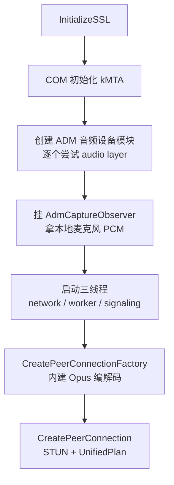

- **三个 WebRTC 线程**：`network`（必须带 SocketServer 跑 socket I/O）、`worker`（编解码/媒体）、`signaling`（PC 状态机），让 WebRTC 不阻塞业务线程。
- **COM 必须 MTA**：Windows 下 ADM 走 Core Audio 需要 COM；这也是 Qt GUI 的坑（Qt 主线程是 STA，所以 GUI 把初始化放后台线程）。
- **Factory 自带 Opus 编解码工厂**，默认 WebRTC 音轨链路靠它编解码；WASAPI 对照链路不依赖它。

> 关键代码：`peer_connection_client.cc` `Initialize()`。

---

## 三、A 端音频采集与发送（两条链路）

| | 默认链路 `webrtc` | 对照链路 `wasapi` |
|---|---|---|
| 采集 | WebRTC ADM | 自写 WASAPI 直采 |
| 处理 | 默认 3A（降噪/AEC/AGC） | **无 3A** |
| 编码 | Opus | 不编码，raw PCM |
| 传输 | RTP 媒体流（SRTP） | DataChannel 二进制帧 |
| B 端入口 | `OnTrack → RemoteAudioSink::OnData` | `OnMessage(binary) → HandlePcmDataChannel` |

> 不管走哪条，`Initialize()` 都会创建 ADM，`EnableLocalAudio()` 也都会挂一条 WebRTC 音轨；区别只在「发给 B 的语音实际走 RTP 还是 DataChannel」。

### 3.1 默认链路：WebRTC ADM 音轨（RTP）

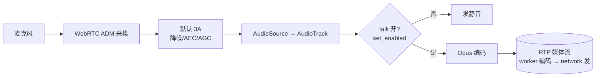

- `EnableLocalAudio()` 用 `CreateAudioSource + CreateAudioTrack + AddTrack`，让首个 Offer 就带上 `m=audio`。
- `SetLocalAudioEnabled(true/false)`（GUI 的「开始说话」/CLI 的 `/talk`）用 `set_enabled` 控制是否发有效语音；内部还兼容了某些设备需先 `StartPlayout` 再 `StartRecording` 的问题。
- 编码在 worker 线程、发包在 network 线程。
- **代价**：3A 在同机调试下会把弱人声当噪声削掉 —— 这正是要保留下面 WASAPI 链路的原因。

### 3.2 对照链路：WASAPI 直采 → DataChannel

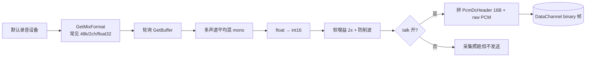

- 采集线程（`wasapi_mic_capture.cc`）：`CoInitializeEx(MTA)` → 默认 `eCapture` 设备 → `IAudioClient` 共享模式 → 轮询 `GetBuffer`，把任意声道/位深统一**混 mono、转 int16、施 2x 软增益**后回调。采样率跟系统 mix format 走（通常 48000）。
- 打包协议：每个二进制帧前缀 16 字节定长头 `PcmDcHeader`（magic="PCM1" / sample_rate / channels / bits / sample_count），raw PCM **不经任何编码**原样塞进 DataChannel，保真喂给 ASR。
- **为什么保留**：同机调试无真实回声参考，WebRTC 3A 会把弱人声削成底噪，导致 whisper「幻觉」出「谢谢观看」之类短语；WASAPI 绕开 3A 可对照验证。

> 关键代码：`peer_connection_client.cc` 的 `EnableLocalAudio / SetLocalAudioEnabled / SendPcmDataChannel`；`wasapi_mic_capture.cc` 的 `CaptureThreadMain`。

---

## 四、B 端如何从 WebRTC 收集音频（RingBuffer + 存取线程）

### 4.1 两条链路对应两个收包入口

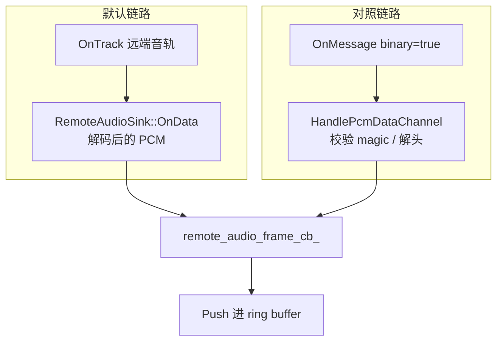

- 两条链路最终都汇到同一个回调 `remote_audio_frame_cb_`，下游处理完全一致。

### 4.2 PcmRingBuffer：线程安全、定容、丢旧帧

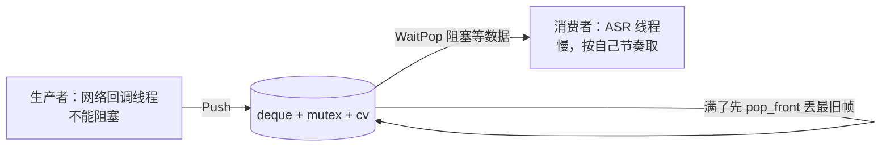

- `Push`：满了就丢最旧一帧（宁可丢历史也不阻塞采集/网络回调），再 `push_back + notify_one`。
- `WaitPop`：`cv.wait` 直到「有数据」或「已关闭」；关闭且空时返回空，消费线程据此退出。
- **作用**：把不能阻塞的生产者和计算重的消费者解耦。

### 4.3 存取线程模型（在 `audiosub_engine.cc` 接线）

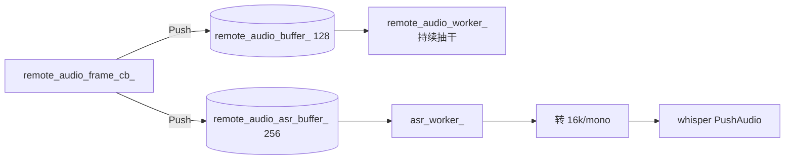

- 远端 PCM 同时 Push 进两个缓冲：`remote_audio_buffer_`（监视/扩展）和 `remote_audio_asr_buffer_`（喂 ASR）。
- 退出时 `Close()` 缓冲 → 各线程 `WaitPop` 返回空 → `join`。

> 关键代码：`pcm_ring_buffer.cc`、`audiosub_engine.cc` 的回调接线与三个 worker 线程。

---

## 五、ASR：从 PCM 到字幕

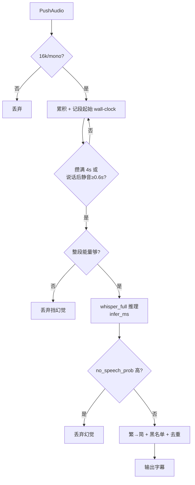

- 输入必须 16k/mono/16bit，否则丢弃。
- **三道幻觉防线**：整段能量门限 → whisper `no_speech_prob` → 关键词黑名单（「谢谢观看/点赞」等）。
- 字幕 `start_ms` / `end_ms` 为段首帧进缓冲与出字完成的 Unix 毫秒；**`ready_ms = end_ms - start_ms`** 为界面「出字延迟」（含攒段 + 推理）。

> 关键代码：`src/asr/whisper_cpp_engine.cc`。

---

## 六、标注通道（A → B）

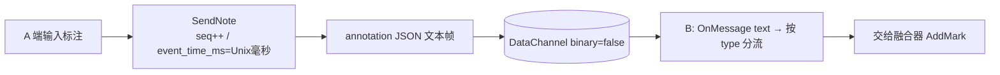

- 标注与回传字幕都走**同一条 DataChannel 的文本帧**，用 JSON 的 `type` 区分。
- 同一通道：`binary=true` 是 WASAPI PCM，`binary=false` 是这套 JSON 协议，互不干扰。

> 关键代码：`include/proto/dc_message.h`；`audiosub_engine.cc` 的 `SendNote / HandlePeerMessage`。

---

## 七、字幕与标注融合（统一时间轴对齐）

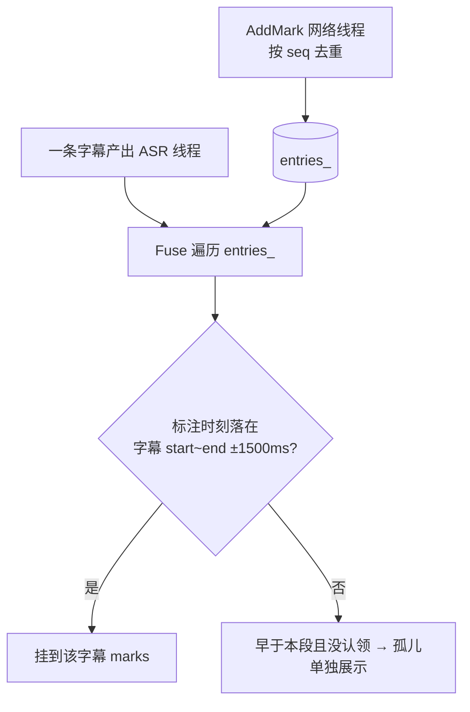

- **对齐判据**：标注时刻落在 `[字幕start−容差, 字幕end+容差]`（容差 1500ms）就归到该字幕。
- **孤儿标注**：早于当前字幕起点又没被认领的，未来字幕只会更晚，判为无归属单独抛出，保证标注不丢。

> 关键代码：`include/fusion/subtitle_mark_fuser.h`。

---

## 八、B → A 字幕回传

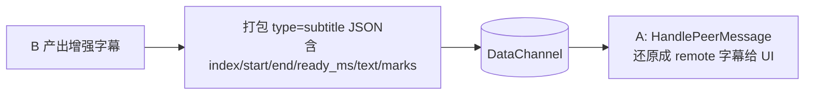

- 这样 **A 也能看到自己说的话被识别成的字幕**；GUI 里 A 的字幕显示在右侧（「我说的」），B 显示在左侧（「对端 A 说的」）。

> 关键代码：`audiosub_engine.cc` 的 `OnSubtitleSegment`（发）/ `HandlePeerMessage`（收）。

---

## 九、指标观测

| 指标 | 含义 |
|------|------|
| 传输 RTT | WebRTC ICE `current_round_trip_time` |
| 出字延迟 | `ready_ms = end_ms - start_ms`（B 端收段→出字幕） |
| 标注误差 | `MarkMatchError` |

运行步骤见 [usage-guide.md](usage-guide.md)；指标详见 [latency-metrics.md](latency-metrics.md)。

---

## 十、退出清理

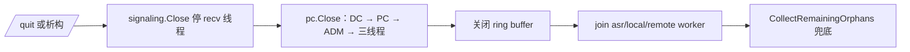

- 顺序很重要：先停信令，再关 WebRTC（先卸 remote sink 防回调访问悬空对象），再 `Close` ring buffer 让消费线程从 `WaitPop` 返回并 `join`。

> 关键代码：`peer_connection_client.cc` `Close()`；`audiosub_engine.cc` `Stop()`。

---

## 附：关键文件索引

| 关注点 | 文件 |
|--------|------|
| 总接线 / 线程 / 缓冲 | `client/audiosub_engine.cc` |
| 信令服务器 | `signaling/server.py` |
| 信令客户端 | `client/signaling_client.{h,cc}` |
| WebRTC / 协商 / 音频收发 | `client/peer_connection_client.{h,cc}` |
| WASAPI 采集 | `client/wasapi_mic_capture.{h,cc}` |
| 环形缓冲 | `include/audio/pcm_ring_buffer.h`, `src/audio/pcm_ring_buffer.cc` |
| 格式转换 | `src/audio/asr_audio_converter.cc` |
| ASR | `src/asr/whisper_cpp_engine.cc` |
| 标注协议 / 融合 | `include/proto/dc_message.h`, `include/fusion/subtitle_mark_fuser.h` |
